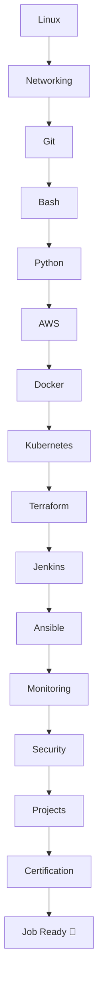

# ☁️ AWS DevOps Engineer Roadmap 2026

<p align="center">


</p>

---

# 🎯 Goal

```text
Beginner
    │
    ▼
Linux
    │
    ▼
Networking
    │
    ▼
Git
    │
    ▼
Bash
    │
    ▼
Python
    │
    ▼
AWS
    │
    ▼
Docker
    │
    ▼
Kubernetes
    │
    ▼
Terraform
    │
    ▼
CI/CD
    │
    ▼
Monitoring
    │
    ▼
Security
    │
    ▼
🚀 AWS DevOps Engineer
```

---

# 🗺️ Learning Timeline

| Phase | Technology | Duration | Difficulty |
|:------:|------------|:--------:|:----------:|
| 🟢 | Linux | 3 Weeks | ⭐ |
| 🟢 | Networking | 2 Weeks | ⭐ |
| 🟢 | Git | 1 Week | ⭐ |
| 🟡 | Bash | 2 Weeks | ⭐⭐ |
| 🟡 | Python | 3 Weeks | ⭐⭐ |
| 🟠 | AWS | 6 Weeks | ⭐⭐⭐ |
| 🟠 | Docker | 3 Weeks | ⭐⭐⭐ |
| 🔵 | Kubernetes | 6 Weeks | ⭐⭐⭐⭐ |
| 🔵 | Terraform | 3 Weeks | ⭐⭐⭐ |
| 🔵 | Jenkins | 4 Weeks | ⭐⭐⭐ |
| 🟣 | Monitoring | 3 Weeks | ⭐⭐⭐ |
| 🔴 | Security | 3 Weeks | ⭐⭐⭐⭐ |

---

# 📊 Roadmap



---

# 🐧 Phase 1 — Linux

<details>
<summary>Click to Expand</summary>

- Terminal
- Filesystem
- Permissions
- Users & Groups
- Processes
- Services
- Networking Commands
- Bash
- SSH
- Cron
- Logs
- Monitoring

</details>

---

# ☁️ Phase 2 — AWS

<details>
<summary>Click to Expand</summary>

### Compute
- EC2
- Lambda
- Auto Scaling

### Storage
- S3
- EBS
- EFS

### Networking
- VPC
- Route53
- ELB

### Security
- IAM
- KMS
- Secrets Manager

### DevOps
- CodeBuild
- CodeDeploy
- CodePipeline
- CloudFormation

</details>

---

# 🐳 DevOps Stack

```text
            GitHub
               │
               ▼
          GitHub Actions
               │
               ▼
            Jenkins
               │
               ▼
            Docker
               │
               ▼
         Kubernetes
               │
               ▼
          Terraform
               │
               ▼
             AWS
               │
               ▼
        CloudWatch
```

---

# 🎓 Certifications

| Order | Certification |
|-------|---------------|
| 🥉 | AWS Cloud Practitioner |
| 🥈 | AWS Solutions Architect Associate |
| 🥈 | AWS Developer Associate |
| 🥈 | AWS SysOps Administrator |
| 🥇 | AWS DevOps Engineer Professional |

---

# 💼 Portfolio Projects

- ✅ Linux Automation
- ✅ AWS Infrastructure
- ✅ Docker Projects
- ✅ Kubernetes Deployment
- ✅ Jenkins Pipeline
- ✅ Terraform Infrastructure
- ✅ Monitoring Dashboard
- ✅ GitHub Actions CI/CD
- ✅ Three-Tier Application
- ✅ Production Deployment

---

# 🎯 Final Tech Stack

```text
Linux
   │
Networking
   │
Git
   │
Bash
   │
Python
   │
AWS
   │
Docker
   │
Kubernetes
   │
Terraform
   │
CI/CD
   │
Monitoring
   │
Security
   │
🚀 AWS DevOps Engineer
```
